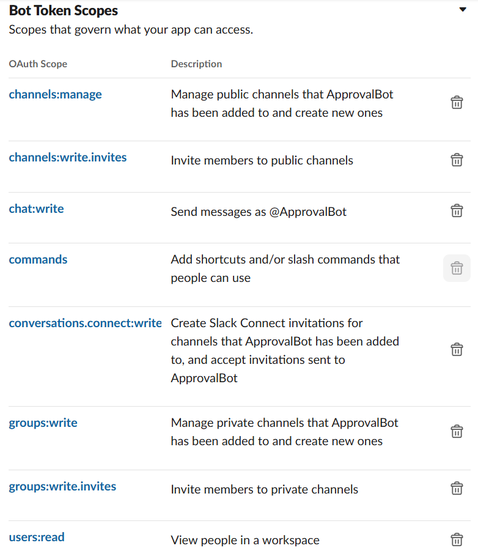
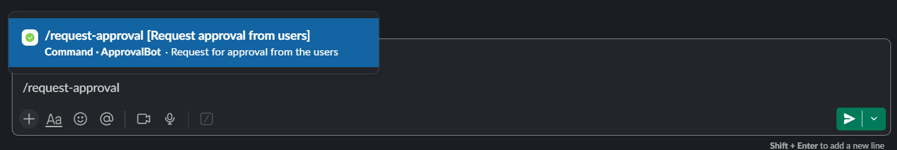
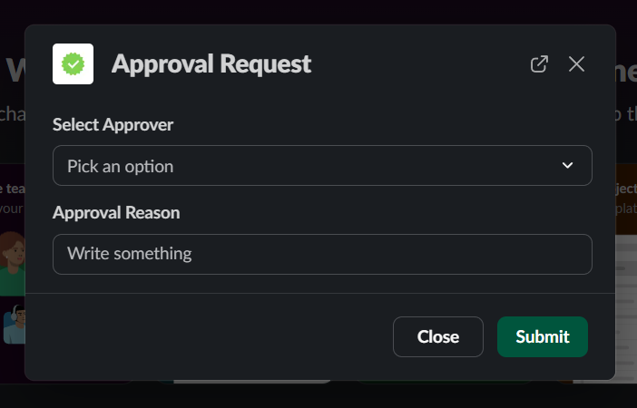

# Slack Approval Bot

A **Slack bot** that streamlines approval requests within a workspace. Users can submit approval requests via a slash command, and only **workspace admins** can approve or reject them. If approved, the requester is automatically added to a hidden channel; if rejected, they receive a notification.

## Features

### Role-Based Approval Requests
- Only **workspace admins** can be selected as approvers.
- The bot filters out non-admin users and deactivated accounts.

### Decision-Based Automation
- If **approved**, the requester is automatically added to a **hidden Slack channel**.
- If **rejected**, the requester receives a notification with the approver's decision.

### Instant Slack Integration
- Users can submit requests using a **simple slash command** (`/request-approval`).
- Approvers receive an interactive **Slack message** with **Approve/Reject** buttons.

### Fully Interactive Slack UI
- Uses **modals and buttons** for an intuitive approval process.
- Approvers see detailed request information before making a decision.

### Persistent Request Tracking
- Approval requests are temporarily stored for tracking decisions.
- Ensures smooth handling of multiple simultaneous requests.

## Installation & Setup

### 1️ Prerequisites
- Node.js (>= 14.x)
- A Slack workspace
- A Slack bot with the required **OAuth permissions** (see below)

### 2️ Clone the Repository
```bash
git clone https://github.com/lohit101/slack-bot.git
cd slack-bot
```

### 3️ Install Dependencies
```bash
npm install
```

### 4️ Configure Environment Variables
Create a `.env` file and add your Slack bot credentials:
```env
PORT=3000
SLACK_BOT_TOKEN=your-bot-token
HIDDEN_CHANNEL_ID=your-hidden-channel-id
```

### 5️ Run the Bot
```bash
npm start
```

## Optional Setups

### 6️ Run with Ngrok (Optional)
If you want to test the bot locally with Slack, you can use Ngrok to expose your local server to the internet.

1.  **Install Ngrok:**
    -   You can download it from the official website: [Ngrok Downloads](https://ngrok.com/download)

2.  **Run Ngrok:**
    ```bash
    ngrok http 3000
    ```

    Replace `3000` with the port your app is running on.

3.  **Update Slack App Settings:**
    -   Copy the Ngrok forwarding URL (e.g., `https://your-ngrok-url.ngrok.io`).
    -   Go to your Slack app settings and update the Request URL in the "Slash Commands" and "Interactive Components" sections.

### 7️ Deploy to Vercel (Optional)

1.  **Install Vercel CLI:**
    ```bash
    npm install -g vercel
    ```

2.  **Deploy:**
    ```bash
    vercel
    ```

    Follow the prompts. Make sure to set the environment variables in the Vercel dashboard.

3.  **Update Slack App Settings:**
    -   After deployment, Vercel will provide you with a URL.
    -   Go to your Slack app settings and update the Request URL in the "Slash Commands" and "Interactive Components" sections.

### 8️ Run with Docker (Optional)

1.  **Create a `Dockerfile`:**
    ```dockerfile
    FROM node:16

    WORKDIR /app

    COPY package*.json ./
    RUN npm install

    COPY . .

    CMD ["npm", "start"]
    ```

2.  **Build the Docker Image:**
    ```bash
    docker build -t slack-approval-bot .
    ```

3.  **Run the Docker Container:**
    ```bash
    docker run -p 3000:3000 -e SLACK_BOT_TOKEN=your-bot-token -e HIDDEN_CHANNEL_ID=hidden-channel-id slack-approval-bot
    ```

    Replace `your-bot-token` and `hidden-channel-id` with your actual credentials.

4.  **Update Slack App Settings:**
    -   If running locally, use Ngrok to expose your local Docker container.
    -   If deploying to a server, use the server's public IP or domain.
    -   Go to your Slack app settings and update the Request URL in the "Slash Commands" and "Interactive Components" sections.

### 9️ Slack App Setup

1.  **Go to Slack API:**
    -   Navigate to the [Slack API website](https://api.slack.com/apps) and click on "Create New App".

2.  **Choose an App Name and Workspace:**
    -   Enter a name for your app (e.g., "Approval Bot") and select the workspace where you want to install it.

3.  **Add a Slash Command:**
    -   In the app's settings, go to "Slash Commands" and click "Create New Command".
    -   Set the command to `/request-approval` and provide a short description.
    -   For the "Request URL", use ```/slack/command``` after your Ngrok URL (if testing locally) or your Vercel/server URL (if deployed).

4.  **Configure Interactive Components:**
    -   Go to "Interactive Components" and enable them.
    -   For the "Request URL", use ```/slack/interactions``` after your URL.

5.  **Set OAuth Permissions:**
    -   Go to "OAuth & Permissions" and add the following bot scopes:
        -   `channels:manage`
        -   `channels:write.invites`
        -   `chat:write`
        -   `commands`
        -   `conversations.connect:write`
        -   `groups:write`
        -   `groups:write.invites`
        -   `users:read`

        

6.  **Install App to Workspace:**
    -   Scroll to the top of the "OAuth & Permissions" page and click "Install to Workspace".
    -   Authorize the app to access your workspace.

7.  **Get Bot User OAuth Token:**
    -   After installing the app, you'll find the "Bot User OAuth Token" on the "OAuth & Permissions" page.
    -   Copy this token and set it as the `SLACK_BOT_TOKEN` environment variable.

Refer to the [Slack API documentation](https://api.slack.com/start) for more details.

## How to Use

### => Submitting an Approval Request
1. In **Slack**, type the following command:
   ```
   /request-approval
   ```

   

2. A **modal will appear** where you can:
   - Select an approver (only workspace admins are shown)
   - Enter a reason for the approval request

   

3. Click **Submit**.

### Approving or Rejecting Requests
1. The selected approver receives a **DM** from the bot with the request details.
2. They can either **Approve** ✅ or **Reject** ❌ the request via buttons.
3. Based on their decision:
   - **Approved** → The requester is added to the **hidden channel**.
   - **Rejected** → The requester receives a notification with the reason.

## Contributing
Feel free to open an issue or submit a pull request!